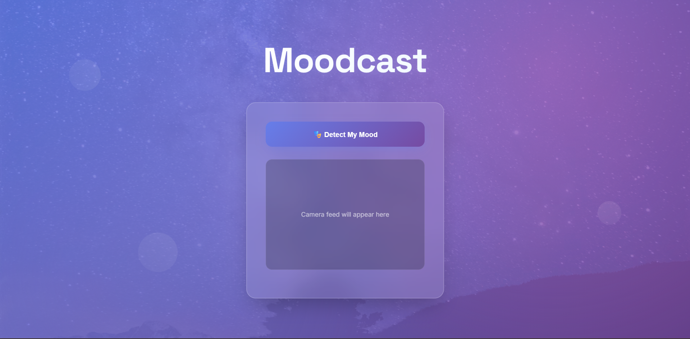
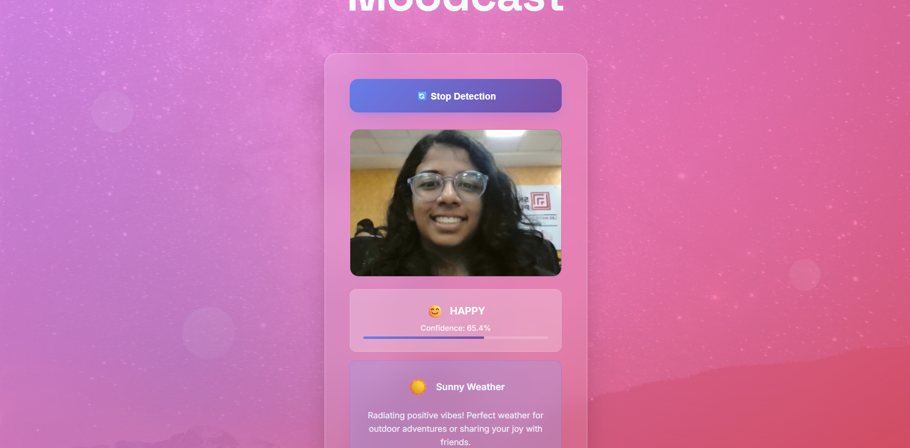
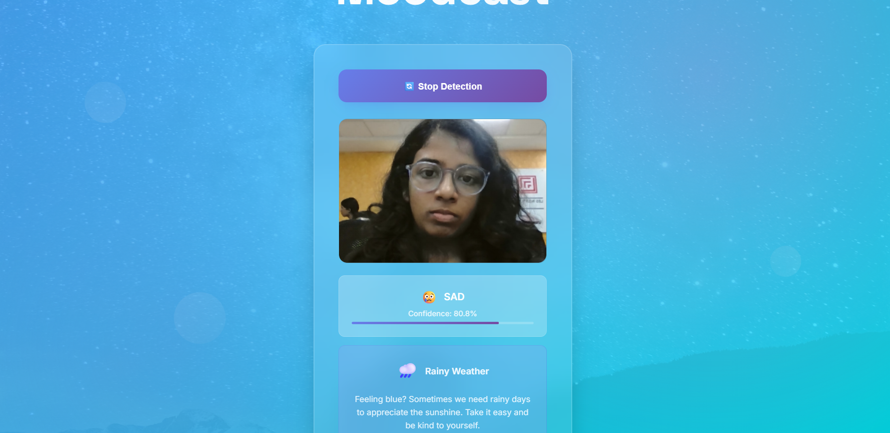

# Moodcast

## Basic Details
### Team Name: Project 404

### Team Members
- Team Lead: Tania Sophy Jose - LBSITW
- Member 2: Upanayana Maya Suresh - LBSITW
- 

### Project Description
Moodcast is your emotionally intelligent weather buddy! Using face detection and emotion recognition from your webcam, Moodcast changes the virtual “weather” of your screen based on how you feel—because sometimes it just needs to rain when you're sad (or show rainbows when you're joyful).

### The Problem (that doesn't exist)
Sometimes, you're feeling sad, and the weather outside is sunny and mocking you. Other times, you're euphoric but your screen background is stuck in a dark mode rut. What if your digital environment matched your emotional environment?

### The Solution (that nobody asked for)
Moodcast uses your face and mood as inputs and displays a matching weather scene as output. Are you sleepy? You’ll get a dreamy moonlit sky. Feeling fiery? A lightning storm will set the tone. We bring the mood weathercast straight to your screen—whether you asked for it or not.

## Technical Details
### Technologies/Components Used
For Software:
-Languages:  HTML, CSS, JavaScript
Tools: Teachables machines

For Hardware:
Webcam (for face input)

### Implementation
For Software:
# Installation
git clone https://github.com/project-404/moodcast.git
cd moodcast
pip install -r requirements.txt

# Run
python app.py

### Project Documentation

# Screenshots (Add at least 3)
Screenshot 1 
*An opening page of the web*

Screenshot2 
*smiling face shows happy mood and is detected*

Screenshot3 
*frowny face shows sad mood and is detected*

## Team Contributions
- Tania Sophy Jose: Team lead, UI/UX design, frontend-backend integration.
- Upanayana Maya Suresh: Idea generation,Testing, documentation.

---
Made with ❤️ at TinkerHub Useless Projects 

